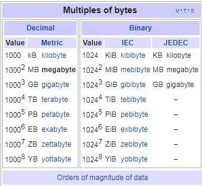

1.638 kb/s = 1,638 B/s -> 342 KB = .342 MB of 87.8 MB, 16 hours left
1,638 B/s * 60 * 60  = 98,280 B/hr = 98.280 Kb/hr = .09828 Mb/hr

56.0 KB/s - 33.8 MB of 87.8 MB, 16 mins left

gb = 1000000000 = .0001 tb 
kb =1000 b = .0001 mb 
mb =1000000 b = 1000 kb = .0001 gb 

  

